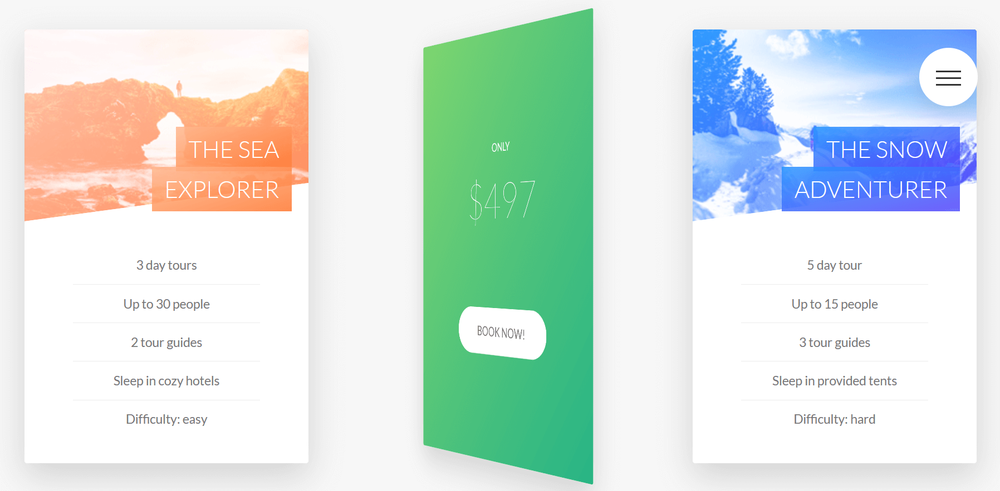
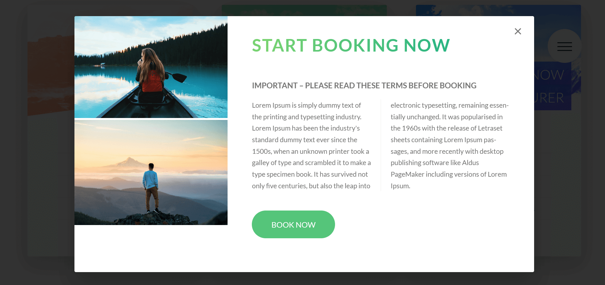
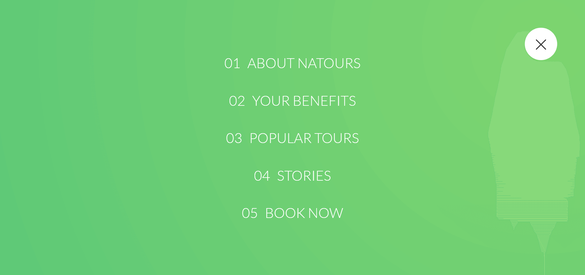
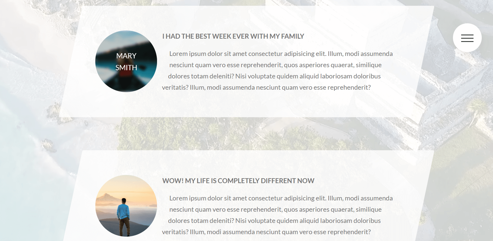
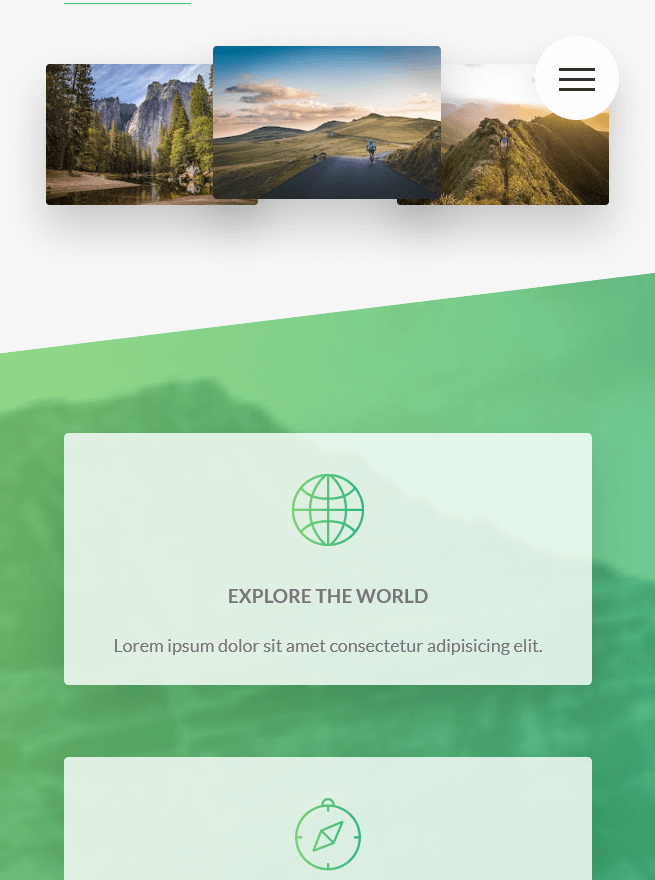

# Natours

## Table of contents

- [Overview](#overview)
  - [The challenge](#the-challenge)
  - [Links](#links)
  - [Screenshot](#screenshot)
- [My process](#my-process)
  - [Built with](#built-with)
- [Author](#author)

## Overview

Users should be able to:

- View the optimal layout for the app depending on their device's screen size
- See hover states for all interactive elements on the page
- Show/Hide menu list
- Open card pop-ups on button click

### Links

- GitHub URL: [https://github.com/Nesh00/natours]
- Live Site URL: [https://natours-nenad.netlify.app/]

### Screenshot

## My process

### Built with

- Semantic HTML5 markup
- CSS
- Responsive Design
- Responsive Images
- Sass
- npm

## Author

- LinkedIn - [https://www.linkedin.com/in/nenad-tsvetanovski-3101b474/]
- Twitter - [https://twitter.com/nenad37452460]
